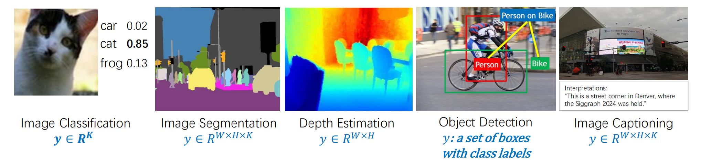

# 课程笔记：特征检测与匹配 (Feature Detection and Matching)

> **- 来源**: `[USTC 图像理解]`
> **- 参考阅读**: `[在此处填写参考书目，例如：Szeliski 2nd Edition Chapter 7]`

## 1. 为什么需要特征？(Motivation)

### 1.1 图像理解的目标
- **输入**: 图像是像素的集合。
- **目标**: 将像素数据转化为有意义的解释。
- **多样化的输出 (y)**:
    - 图像分类 (Image Classification)
    - 物体检测 (Object Detection)
    - 图像分割 (Image Segmentation)
    - 图像描述 (Image Captioning)

### 1.2 特征在图像任务中的应用
- **核心思想**: `[在此处填写核心思想]`
- **应用场景**:
    - `[此处列举具体的应用，例如：]`
    - 图像对齐与拼接
    - 三维重建
    - 运动追踪
    - 物体识别

## 2. 图像特征的分类

### 2.1 全局特征 (Global Features)
- **定义**: `[在此处填写定义]`
- **代表方法**: `[例如：颜色直方图]`
- **优缺点**: `[在此处填写优缺点]`

### 2.2 局部特征 (Local Features)
- **定义**: `[在此处填写定义]`
- **核心步骤**:
    1.  关键点检测 (Key-point Detection)
    2.  邻域定义 (Neighborhood Definition)
    3.  内容提取与归一化 (Extraction & Normalization)
    4.  描述子计算 (Descriptor Computation)
    5.  描述子匹配 (Descriptor Matching)
- **优势**: `[在此处填写优势]`

## 3. 关键点检测 (Keypoint Detection)

### 3.1 什么样的点是好的关键点？
- **核心要求**: `[例如：独特性 和 可重复性]`
- **直观理解**:
    - `[例如：平坦区域]`
    - `[例如：边缘区域]`
    - `[例如：角点区域]`

### 3.2 Harris 角点检测器 (Harris Corner Detector)
- **数学原理**:
    - **自相关矩阵 A**: `[在此处填写公式或解释]`
    - **特征值分析**:
        - `[此处解释λ1, λ2与区域类型的关系]`
    - **角点响应函数 R**: `[在此处填写公式]`
- **算法流程**:
    1.  `[在此处填写具体步骤]`
    2.  `...`

## 4. 特征的不变性 (Invariance)

### 4.1 为什么需要不变性？
- `[在此处填写核心原因]`
- **几何不变性**: `[例如：平移、旋转、尺度]`
- **光度不变性**: `[例如：亮度、曝光]`

### 4.2 尺度不变性 (Scale Invariance)
- **核心思想**: `[在此处填写核心思想]`
- **实现方式**: `[例如：高斯金字塔, 高斯差分 (DoG)]`

## 5. SIFT (Scale-Invariant Feature Transform)

- **提出者**: `[在此处填写提出者]`
- **核心优势**: `[在此处填写核心优势]`

### 5.1 SIFT 检测器 (Detector)
1.  `[在此处填写具体步骤]`
2.  `...`

### 5.2 SIFT 描述子 (Descriptor)
1.  `[在此处填写具体步骤]`
2.  `...`

## 6. 其他特征检测与描述方法

### 6.1 ORB (Oriented FAST and Rotated BRIEF)
- **特点**: `[例如：速度极快]`
- **构成**: `[例如：Oriented FAST + Rotated BRIEF]`

## 7. 总结与展望

- **关键点检测思想演进**: `[在此处填写总结]`
- **发展趋势**: `[例如：语义关键点，基于深度学习的方法]`